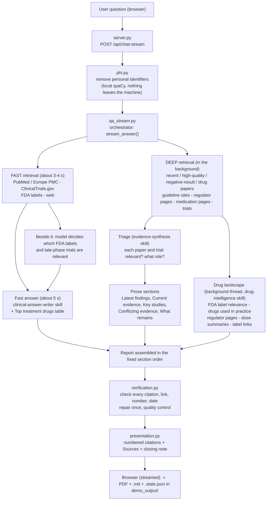
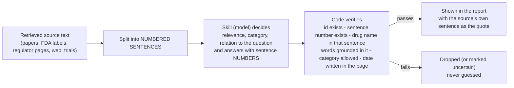

# NeuroGPT - clinical research agent

NeuroGPT answers a clinical or medical research question with a **sourced, structured report**, shown in the browser as it is being written and saved as a **PDF**.

It searches PubMed / Europe PMC, ClinicalTrials.gov, FDA drug labels (openFDA / DailyMed), regulator pages and guideline pages. Language-model **skills interpret** what was retrieved, and **deterministic code verifies** every interpretation against the original source text before anything reaches the report.

> **Research support, not medical advice.** The report summarises retrieved sources and links to them. It is not a substitute for clinical judgement, and it is not a complete safety review.

---

## Contents

1. [What you get](#what-you-get)
2. [How it works (flow diagrams)](#how-it-works)
3. [What the model does and what the code does](#what-the-model-does-and-what-the-code-does)
4. [How a model answer is verified](#how-a-model-answer-is-verified)
5. [Project structure](#project-structure)
6. [Setup](#setup)
7. [Environment variables (`.env`)](#environment-variables-env)
8. [Run it](#run-it)
9. [Outputs and API](#outputs-and-api)
10. [Tests and audit](#tests-and-audit)
11. [Speed: what the latency depends on](#speed-what-the-latency-depends-on)
12. [Privacy](#privacy)
13. [Known limits](#known-limits)

---

## What you get

Ask a question in the browser (for example *"How to treat autism in children?"*). The answer is streamed in this fixed order, and the PDF has exactly the same sections:

| # | Section | Content | Written by |
|---|---|---|---|
| 1 | **Clinical summary** | Bottom line, most important recent finding, immediate context, then a **Top treatment drugs** table (established FDA-labelled drugs first, then the most notable latest investigational drug). Shown in about 5 seconds. | Model text + code-built table |
| 2 | **Latest findings** | Up to 4 dated bullets. A date later than the search date is shown as "Advance publication (issue dated ...)". | Model, checked by code |
| 3 | **Current evidence** | Table: approach, evidence level, what the evidence shows, reference. | Model, checked by code |
| 4 | **Treatment Drug Landscape** | *Drugs used for treatment of this condition* (FDA-labelled / guideline), *Other drugs: used for symptoms*, *Recently approved or updated (FDA, EMA and CDSCO announcements)*, *Safety warnings (FDA boxed warnings)*. | Code-built from sources; the model only decides relevance and shortens dose text |
| 5 | **Clinical trials** | Registered treatment trials with phase, status and last update, from ClinicalTrials.gov. | Code (registry facts) + model relevance decision |
| 6 | **Key studies** | Numbered studies with author, year, design, finding, PMID. | Model, incomplete entries removed by code |
| 7 | **Conflicting evidence** | Real disagreement between sources, or "none retrieved". | Model |
| 8 | **What remains under investigation** | Short bullets. | Model |
| 9 | **Evidence limitations** | Which sources failed, what was excluded, what is not known. Failed sources are never reported as "no evidence". | Code |
| 10 | **Sources** | Numbered list; every `[n]` in the report points to it. | Code |

---

## How it works

### Overall flow (plain-text version, shows in any viewer)

```text
 USER QUESTION (browser)
        |
        v
 server.py  --  POST /api/chat-stream
        |
        v
 phi.py  --  remove personal identifiers (local spaCy; nothing leaves the machine)
        |
        v
 qa_stream.py  --  ORCHESTRATOR  stream_answer()
        |
        +--------------------------------------+---------------------------------------------+
        |                                      |                                             |
        v                                      v                                             v
 FAST RETRIEVAL (about 3 s)             DEEP RETRIEVAL (background)                  Model decides which FDA labels
 PubMed / Europe PMC                    recent / quality / negative-result /         and late-phase trials are relevant
 ClinicalTrials.gov                     drug papers, guideline sites,                (runs beside the fast answer)
 FDA labels, web                        regulator pages, medication pages, trials               |
        |                                      |                                                |
        v                                      |                                                |
 FAST ANSWER (about 5 s)  <-----------------------------------------------------------------+
 clinical-answer-writer skill
 + "Top treatment drugs" table
        |                                      |
        |                          +-----------+----------------------+
        |                          |                                  |
        |                          v                                  v
        |                 TRIAGE (evidence-synthesis)        DRUG LANDSCAPE (background thread, drug-intelligence)
        |                 each paper / trial: relevant?      FDA label relevance, drugs used in practice,
        |                 what evidence role?                regulator pages, dose summaries, label links
        |                          |                                  |
        |                          v                                  |
        |                 PROSE SECTIONS                              |
        |                 Latest findings, Current evidence,          |
        |                 Key studies, Conflicting evidence,          |
        |                 What remains under investigation            |
        |                          |                                  |
        +--------------------------+----------------------------------+
                                   |
                                   v
                 REPORT ASSEMBLED in the fixed section order
                                   |
                                   v
                 verification.py  --  check every citation, link, number and date;
                                      repair once; quality control
                                   |
                                   v
                 presentation.py  --  numbered citations [n], Sources list, closing note
                                   |
                                   v
                 BROWSER (streamed)  +  PDF, .md and .state.json in demo_output/
```

### Overall flow (diagram; GitHub draws it, VS Code needs a Mermaid extension)



### Timeline of one question (typical, varies with the outside services)

```text
 0 s   question received, personal identifiers removed
 3 s   fast retrieval done (PubMed/Europe PMC, trials, FDA labels, web)
 5 s   FIRST USEFUL ANSWER: Clinical summary text; Top treatment drugs table follows within a few seconds
10 s   deep retrieval done; triage of every paper and trial starts (2-3 s)
13 s   Latest findings / Current evidence start streaming
22 s   Treatment Drug Landscape appears (it was built in the background)
28 s   Key studies ... Evidence limitations; verification; final report + PDF
```

### The model reads, the code checks



---

## What the model does and what the code does

**Design rule:** retrieval finds, skills interpret, code verifies. No clinical meaning is hard-coded: there are no rules such as "if the text contains *approved* then it is an approval", and nothing is specific to any disease or drug. The fixed things are the contracts: schemas, allowed categories, verification checks, source allow-lists and the report structure.

| Step | Skill file loaded (system prompt) | Receives | Returns |
|---|---|---|---|
| Understand the question | `clinical-research-orchestrator` | The question | Intent, condition, search queries |
| Fast answer | `clinical-answer-writer` | A few papers, trials, web items, FDA label indications | Bottom line, recent finding, context |
| Paper and trial triage | `evidence-synthesis` | Every retrieved paper / registry record as numbered sentences | Relevance, evidence role, supporting sentence number |
| Latest findings ... What remains | `evidence-synthesis` | The papers the triage judged relevant, with their roles and dates | The prose sections |
| FDA label relevance | `drug-intelligence` | Each label's indication as numbered sentences | Relevant or not, relation to the condition, sentence number |
| Drugs used in practice | `drug-intelligence` | Sources in groups of four, as numbered sentences | Drug, kind (generic / brand / class), statement type, category, sentence number |
| Regulator pages | `drug-intelligence` | Page text as numbered sentences | Approval / label update / safety communication / other / not relevant, relation, sentence numbers |
| Dose summary | `drug-intelligence` | The label's dosing section | 3-4 plain sentences (numbers checked against the label) |

All JSON-reading calls run at **temperature 0**, so the same input gives the same decision.

**Code only (no model):** retrieval, the FDA drug tables (indication text, label date, route, DailyMed links), boxed warnings in the label's own words, the trials table, evidence limitations, citation numbering, the Sources list, PDF rendering.

**Skills in `skills/`:** eight `SKILL.md` files follow the specification (orchestrator, latest-evidence, drug-intelligence, clinical-trials, evidence-synthesis, citation-verification, clinical-answer-writer, quality-control). Four are sent to the model as instructions (orchestrator, clinical-answer-writer, evidence-synthesis, drug-intelligence). The other four stages (latest-evidence retrieval, clinical-trials retrieval, citation verification, quality control) are done by code and are kept as written contracts.

---

## How a model answer is verified

Every model decision must point back to retrieved evidence, and code checks it:

- the **source id** exists and the **sentence number** exists in that source;
- the **drug name** is in the sentence it points at, and the name is one specific drug (a drug class is rejected; a brand is shown with the generic name read from its FDA label);
- the **indication / population words** are grounded in that sentence (otherwise the model's wording is not shown and the sentence speaks for itself);
- the **category** is one of the fixed values, and "Guideline-recommended" needs a page of an organisation in `config/care_topics.json`;
- a **date** is shown only if it is written in the page text (the page itself is read for its date); announcements are listed as recent only if dated within 3 years of the search date;
- a **dose** is shown only from the FDA label, and every number in a model summary must appear in the label text;
- trial phase, status and dates come only from the registry record;
- every **PMID, DOI, NCT id and link** in the final report must exist in what was retrieved; unretrieved ones are removed;
- wording checks: overclaims ("proven", "confirmed"), "established" without a guideline, dose-response wording, claims about trials without posted results;
- a finding **dated after the search date** is shown as an advance publication.

If a source fails or times out, the report says so. It never turns a failed search into "no evidence exists".

---

## Project structure

```text
.
├── server.py            Local web server (port 8000): static files, /api/chat-stream, model builder, conversation log
├── qa_stream.py         The orchestrator: stream_answer() runs retrieval, skills, assembly, verification; also a command-line runner
├── clinical_tools.py    Retrieval tools: PubMed / Europe PMC, ClinicalTrials.gov, openFDA labels + DailyMed links, page dates
├── landscape.py         Drug landscape, regulator announcements, boxed warnings, trials table, limitations; verification of model decisions
├── verification.py      Citation / claim / number / date verification, one repair pass, quality control
├── report.py            Key-studies helpers
├── presentation.py      Numbered citations [n], Sources list, closing note
├── guidelines.py        Guideline-site search (domains and topics come from config/care_topics.json)
├── phi.py               Personal-identifier scrubbing (local spaCy model + rules)
├── pdf_export.py        Markdown -> PDF (reportlab); this is where heading levels and tables are styled
├── pipeline.py          save_pdf / strip_preliminary (plus an older single-pass pipeline kept for reference)
├── audit.py             Independent audit script for a saved report (32 checks)
├── stream_client.py     Small command-line client for the streaming endpoint
├── index.html, app.js, style.css   Browser front end (stage bar, streamed answer, timing line)
├── config/care_topics.json         Authoritative guideline domains and search topics
├── skills/              The eight SKILL.md contracts (+ skills/README.md)
├── tests/               Unit tests (no network or model needed) and a PHI-miss report script
├── demo_output/         Saved reports: <slug>.md, <slug>.pdf, <slug>.state.json (cli_test_runs/ for command-line runs)
├── requirements.txt     Python dependencies
└── .env.example         Template for your keys (copy to .env)
```

`conversation_history/` is created at run time (one Markdown log per browser conversation, with personal identifiers removed). It is not needed to produce a report and is ignored by git.

---

## Setup

Requirements: **Python 3.10 or newer** (developed and tested on 3.13) and internet access.

```powershell
# 1. create and activate a virtual environment (Windows PowerShell)
python -m venv .venv
.\.venv\Scripts\Activate.ps1

# 2. install the dependencies (includes the spaCy English model used for name removal)
python -m pip install -r requirements.txt

# 3. create your .env from the template and put in your keys
copy .env.example .env
```

On macOS / Linux: `python3 -m venv .venv && source .venv/bin/activate`, then the same `pip install` and `cp .env.example .env`.

**Always start the server with the project's Python** (`.venv`). A global Python without these packages fails with errors such as "`mistralai` not installed".

---

## Environment variables (`.env`)

Never commit `.env`; `.gitignore` already excludes it. Copy `.env.example` and fill in your own keys.

| Variable | Needed? | Meaning |
|---|---|---|
| `MODEL_PROVIDER` | yes | `mistral` or `groq`. Chooses the language model provider. |
| `MISTRAL_API_KEY` | if `mistral` | Key from the Mistral console. |
| `MISTRAL_MODEL` | if `mistral` | Model id, for example `open-mistral-nemo` (fast, cheap) or `mistral-small-latest` (better at following formats, a little slower). |
| `GROQ_API_KEY` | if `groq` | Key from Groq. |
| `GROQ_MODEL` | optional | Default `openai/gpt-oss-120b`. |
| `MODEL_TIMEOUT_S` | optional | A model call with no answer after this many seconds fails instead of hanging the report (default 30). |
| `TAVILY_API_KEY` | recommended | Main web search (regulator, guideline and medication pages). Without it, or when the plan limit is reached, the slower, less reliable DDGS search is used and the drug and regulator parts get fewer sources. One question uses roughly 10 searches. |
| `NCBI_API_KEY` | recommended | Free key that raises PubMed's rate limit from about 3 to 10 requests a second. Get it at ncbi.nlm.nih.gov -> account -> Account settings -> API Key Management. |
| `NEUROGPT_NO_BROWSER` | optional | Set to `1` to stop the server opening your browser on start. |

No key is needed for ClinicalTrials.gov, openFDA, DailyMed, Europe PMC or the local name detector.

---

## Run it

```powershell
.\.venv\Scripts\python.exe server.py
```

The server opens `http://localhost:8000` in your browser. Type a clinical question and watch the stage bar (Fast answer -> Evidence -> Drugs -> Trials -> Verification -> Final). Stop it with `Ctrl+C`; only one server can use port 8000.

After editing code, restart the server and press `Ctrl+F5` in the browser, because the browser may keep the old page script.

Command-line run (writes to `demo_output/cli_test_runs/`, so it never overwrites a browser answer):

```powershell
.\.venv\Scripts\python.exe qa_stream.py "How to treat autism in children?"
```

---

## Outputs and API

Each browser question saves three files in `demo_output/`, named from the question (`how-to-treat-autism-in-children.*`):

- `.pdf` - the report (same sections and order as on screen)
- `.md` - the same report as Markdown
- `.state.json` - everything retrieved and every model decision (what was offered, what was accepted or rejected and why, timings), for audit

**Endpoint:** `POST /api/chat-stream` with `{"messages": [{"role": "user", "content": "..."}], "conversation_id": "..."}`. It streams newline-delimited JSON events:

| Event `type` | Meaning |
|---|---|
| `stage` | A stage began: `INITIAL`, `EVIDENCE_ENRICHING`, `DRUGS_ENRICHING`, `TRIALS_ENRICHING`, `VERIFICATION`, `FINAL` |
| `token` | A piece of report text to append |
| `milestone` | Timing marks such as `first_useful_answer` |
| `warning`, `error` | A problem the reader should know about |
| `verification` | Verification result and what was repaired |
| `final` | The complete verified Markdown, timings and state |
| `pdf` | Where the PDF was saved |

`POST /api/chat` returns the same final report in one response (for old clients).

---

## Tests and audit

```powershell
# unit tests: no network, no model, about 10 seconds
.\.venv\Scripts\python.exe -m unittest discover -s tests -t .

# independent check of a saved report (reads demo_output/<slug>.md and .state.json)
.\.venv\Scripts\python.exe audit.py how-to-treat-autism-in-children

# which person names the local detector misses (known limits)
.\.venv\Scripts\python.exe tests\phi_misses.py
```

The tests cover verification of model decisions (quotes, sentence numbers, categories, dates), report structure and heading order, citation numbering, regulator classification, trial relevance, personal-identifier removal and the PDF-facing text.

---

## Speed: what the latency depends on

The first useful answer takes about 5 seconds and the whole report 25-35 seconds in normal conditions. The time depends on:

- **the language model**: every written section and every decision call waits on it; a single call took 1-7 s and a stalled call can cost up to `MODEL_TIMEOUT_S`;
- **the search services**: Europe PMC varied between 2 and 14 s, and web search falls back to a slow engine when the Tavily key is out of quota;
- **the number of steps that must run in order**: retrieval -> fast answer -> triage -> prose. Everything else (drug landscape, regulator reading, label lookups, dose summaries) runs in parallel in a background thread.

Built-in protections: the fast pass waits at most 4.5 s per source; Europe PMC has a PubMed fallback; the triage is waited for at most 3.5 s; label lookups and dose summaries get at most 4 s; results are cached for repeated questions.

---

## Privacy

Before anything is searched, sent to a model or saved, `phi.py` removes names, IDs, dates of birth, phone numbers, e-mail addresses and street addresses from the question. It keeps age, sex, conditions, drugs, doses and lab values. Detection runs **locally** (spaCy plus rules). The scrubbed question is what goes to the model provider, PubMed, the web search and the conversation log. Detection is not perfect; `tests/phi_misses.py` lists known misses. Do not enter real patient identifiers.

---

## Known limits

- The model can still make mistakes that grounding cannot detect: for example calling a drug "used in practice" from a hedged sentence, or classifying an irrelevant regulator page as an action. Every shown item is grounded in a real sentence of its source, but a grounded sentence can be misread.
- The list of "other drugs" and regulator announcements varies between runs because web search returns different pages and the model's answers depend on them.
- For a very broad question (for example "cancer"), the FDA label search returns labels that mention the condition most often, so the approved-drug table can contain supportive-care drugs; the main cancer drugs then appear under "Other drugs" from web and regulator pages.
- Dose text is taken from the label section whose title names the condition; if none is found, the cell says so.
- PubMed "dates" for early online articles are the scheduled issue date; they are shown as advance publications when later than the search date.
- Search quality and speed depend on outside services (Mistral/Groq, Tavily, Europe PMC, NCBI, openFDA) and their rate limits.
- Not a medical device and not validated for clinical use.
